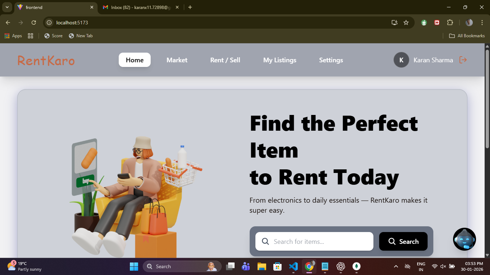
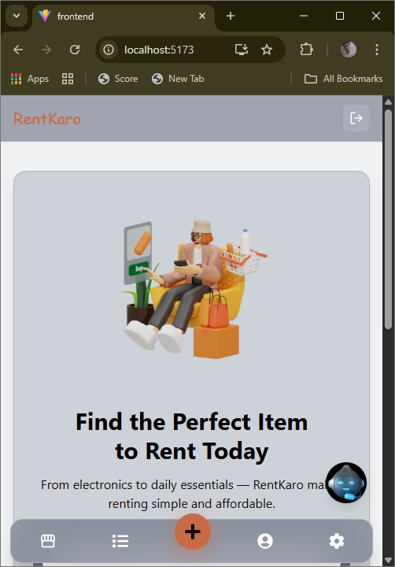
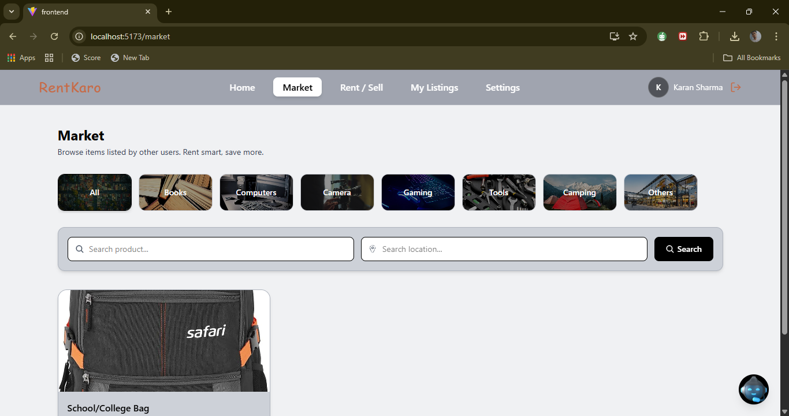
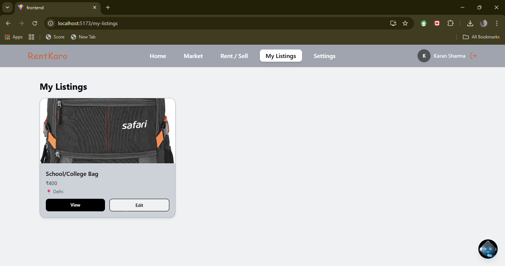
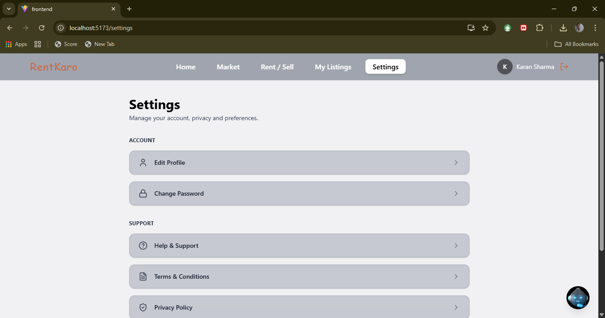

# 🚀 RentKaro — Modern Rental Marketplace Platform

    RentKaro is a full-stack rental marketplace that allows users to rent, sell, and manage products seamlessly.
    Built with the MERN stack, RentKaro focuses on speed, scalability, and a clean user experience across web and mobile devices.

        Think of it as a lightweight, modern alternative to OLX / Rentomojo for rentals.

## ✨ Key Highlights

    🏠 Product rental & selling platform
    📱 Fully responsive (Web + Mobile UI)
    📦 User listings & product management
    🤖 AI-powered chatbot assistance
    🔐 Secure backend with authentication-ready architecture
    ⚡ Fast frontend using Vite + React
    🧩 Clean, scalable project structure

## 🧠 Tech Stack

### Frontend

    React (Vite)
    JavaScript (ES6+)
    CSS (modern styling)
    React Router
    Custom hooks & services layer

### Backend

    Node.js
    Express.js
    MongoDB
    Mongoose
    REST APIs
    npm
    Git & GitHub

## 🗂️ Project Structure
    RentKaro/
    │
    ├── web-backend/               # Backend (Node + Express)
    │   ├── config/                # DB & app configuration
    │   ├── controllers/           # Route logic
    │   ├── middleware/            # Auth & request middleware
    │   ├── models/                # Mongoose schemas
    │   ├── routes/                # API routes
    │   ├── uploads/               # Uploaded files
    │   ├── utils/                 # Helper utilities
    │   ├── server.js              # Backend entry point
    │   ├── testMongo.js           # MongoDB connection test
    │   └── package.json
    │
    ├── web-frontend/              # Frontend (React + Vite)
    │   ├── public/
    │   ├── src/
    │   │   ├── api/               # API integrations
    │   │   ├── assets/            # Images & screenshots
    │   │   ├── components/        # Reusable UI components
    │   │   ├── hooks/             # Custom React hooks
    │   │   ├── pages/             # App pages
    │   │   ├── routes/            # Routing
    │   │   ├── services/          # Business logic
    │   │   ├── utils/             # Helpers
    │   │   ├── App.jsx
    │   │   └── main.jsx
    │   └── package.json
    │
    └── README.md

## ⚙️ Getting Started
    🔹 Clone Repository
    git clone https://github.com/Karanx11/RentKaro.git
    cd RentKaro

## 🖥️ Frontend Setup
    cd web-frontend
    npm install
    npm run dev

### 📍 Runs at:

    http://localhost:5173

## 🔧 Backend Setup
    cd web-backend
    npm install
    npm run dev

### 📍 API runs at:

    http://localhost:5000

### ⚠️ Create a backend.env file and add:

    MONGO_URI=your_mongodb_connection
    PORT=5000

## 📸 Screenshots

🏠 Home (Web)

📱 Home (Mobile)

🛒 Market (Web)

📦 My Listings

🔁 Rent / Sell

⚙️ Settings

🤖 AI Chatbot

## 🧩 Core Features

    Product listing & browsing

    Rent / Sell workflow

    Category-based navigation

    Image uploads

    AI Chatbot UI

    User dashboard (Listings & Settings)

## 🚧 Roadmap

    🔐 Authentication (JWT)

    📍 Location-based discovery

    🔔 Notifications

    📱 Progressive Web App (PWA)

    📊 Admin dashboard

    👨‍💻 Founder & Developer

        Karan Sharma
        📍 India
        🔗 GitHub: @Karanx11

## 📄 License

    Licensed under the MIT License — free to use and modify.